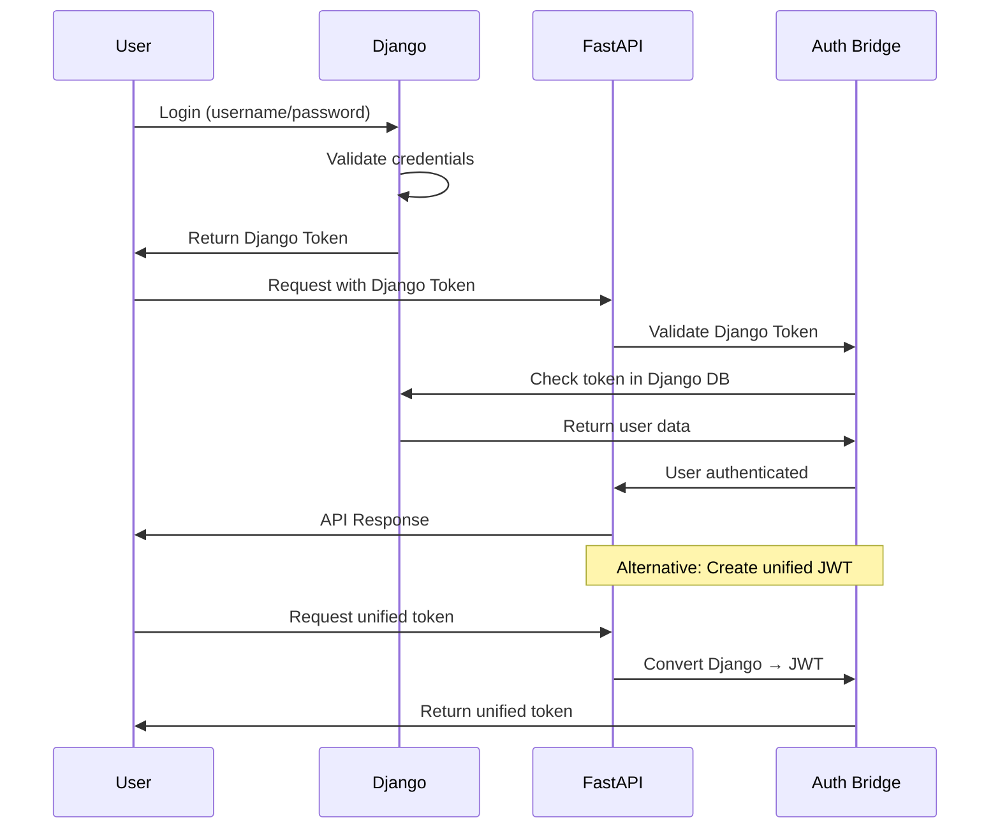

# 🔗 Django-FastAPI Integration Guide

Welcome to **Paktolus** - a fully integrated Django + FastAPI application with shared authentication and unified user management!

## 🎯 What We've Built

### ✅ **Completed Features**

1. **🔧 Fixed Terminal Issues**

   - ✅ Fixed pytest-asyncio configuration
   - ✅ Resolved async test execution
   - ✅ Fixed FastAPI deprecation warnings
   - ✅ Updated Pydantic configuration

2. **🔗 Django-FastAPI Integration**

   - ✅ Unified authentication system
   - ✅ Cross-platform token validation
   - ✅ Shared user management
   - ✅ Seamless API integration

3. **🚀 Integration Features**
   - ✅ Django REST Framework ↔ FastAPI JWT tokens
   - ✅ Cross-platform user authentication
   - ✅ Unified server management
   - ✅ Comprehensive testing suite

---

## 🏗️ **System Architecture**

```
┌─────────────────┐    ┌─────────────────┐
│   Django App    │    │   FastAPI App   │
│   Port: 8000    │    │   Port: 8001    │
├─────────────────┤    ├─────────────────┤
│ • User Mgmt     │◄──►│ • Async APIs    │
│ • Admin Panel   │    │ • File Upload   │
│ • REST API      │    │ • Real-time     │
│ • Templates     │    │ • Documentation │
└─────────────────┘    └─────────────────┘
         │                       │
         └──────┬─────────────┬──┘
                │             │
         ┌─────────────────────────┐
         │   Shared Components     │
         ├─────────────────────────┤
         │ • Authentication Bridge │
         │ • User Database         │
         │ • Unified Tokens        │
         │ • Cross-platform Auth   │
         └─────────────────────────┘
```

---

## 🚀 **Quick Start**

### **Method 1: Using Django Management Command (Recommended)**

```bash
# Start both servers with integrated management
python manage.py start_integrated

# Custom ports
python manage.py start_integrated --django-port 8000 --fastapi-port 8001

# Disable FastAPI auto-reload
python manage.py start_integrated --no-reload
```

### **Method 2: Using Integration Script**

```bash
# Run the integration server
python integration.py
```

### **Method 3: Manual Start (Development)**

```bash
# Terminal 1: Django
python manage.py runserver 8000

# Terminal 2: FastAPI
uvicorn fastapi_app.main:app --port 8001 --reload
```

---

## 🔐 **Authentication Integration**

### **How It Works**

1. **Django Authentication** → Creates Django REST Framework tokens
2. **FastAPI Integration** → Accepts Django tokens OR creates unified JWT tokens
3. **Cross-Platform** → Single login works across both applications

### **Authentication Flow**



### **Available Endpoints**

#### **Django Endpoints** (Port 8000)

```
📱 Django Application
├── /admin/                  # Django Admin
├── /api/v1/auth/login/      # Django REST login
├── /api/v1/auth/register/   # Django REST register
├── /api/v1/profile/         # User profile
└── /api/v1/users/           # User management
```

#### **FastAPI Endpoints** (Port 8001)

```
⚡ FastAPI Application
├── /api/docs                # Interactive docs
├── /api/auth/login          # FastAPI login
├── /api/auth/django-login   # Django token → JWT
├── /api/auth/me             # Current user (accepts Django tokens!)
├── /api/auth/django-status  # Integration status
├── /api/users/              # User CRUD (async)
├── /api/products/           # Product management
└── /api/files/              # File upload/download
```

---

## 🧪 **Testing the Integration**

### **Run Comprehensive Tests**

```bash
# Run the integration test suite
python test_integration.py

# Or specific test categories
pytest fastapi_app/tests/ -v  # FastAPI tests
python manage.py test         # Django tests
```

### **Manual Testing**

1. **Create a Django User**:

   ```bash
   python manage.py createsuperuser
   ```

2. **Get Django Token**:

   ```bash
   curl -X POST http://localhost:8000/api/v1/auth/login/ \
     -H "Content-Type: application/json" \
     -d '{"username": "admin", "password": "yourpassword"}'
   ```

3. **Use Token with FastAPI**:

   ```bash
   curl -X GET http://localhost:8001/api/auth/me \
     -H "Authorization: Bearer YOUR_DJANGO_TOKEN"
   ```

4. **Create Unified Token**:
   ```bash
   curl -X POST "http://localhost:8001/api/auth/django-login?django_token=YOUR_DJANGO_TOKEN"
   ```

---

## 📁 **Project Structure**

```
Paktolus/
├── 🔧 Integration Files
│   ├── integration.py                    # Unified server manager
│   ├── test_integration.py              # Integration tests
│   └── INTEGRATION_README.md            # This file
│
├── 📱 Django App
│   ├── accounts/                        # User management
│   │   ├── management/commands/         # Custom commands
│   │   │   └── start_integrated.py     # Integrated server command
│   │   ├── api_views.py                # Django REST API
│   │   ├── serializers.py              # DRF serializers
│   │   └── models.py                   # User models
│   ├── user_management/                # Django project
│   └── manage.py                       # Django management
│
├── ⚡ FastAPI App
│   ├── fastapi_app/
│   │   ├── integration.py              # Django-FastAPI bridge
│   │   ├── main.py                     # FastAPI application
│   │   ├── dependencies.py             # Auth dependencies
│   │   ├── routers/                    # API routes
│   │   │   ├── auth.py                 # Authentication (+ Django integration)
│   │   │   ├── users.py                # User management
│   │   │   ├── products.py             # Product management
│   │   │   └── files.py                # File operations
│   │   ├── tests/                      # Async tests
│   │   └── middleware.py               # Custom middleware
│   │
└── 🌐 Frontend (Next.js)
    └── frontend/                       # React/Next.js application
```

---

## 🔧 **Integration Components**

### **1. Authentication Bridge** (`fastapi_app/integration.py`)

- Validates Django REST Framework tokens
- Creates unified JWT tokens
- Syncs users between systems
- Cross-platform authentication

### **2. Enhanced Dependencies** (`fastapi_app/dependencies.py`)

- Supports both Django tokens and JWT tokens
- Integrated permission checking
- Seamless user authentication

### **3. Django Management Command** (`accounts/management/commands/start_integrated.py`)

- Starts both servers simultaneously
- Health monitoring
- Graceful shutdown

### **4. Integration Tests** (`test_integration.py`)

- End-to-end authentication testing
- Cross-platform validation
- Health checks

---

## 🌟 **Key Features**

### **✅ Unified Authentication**

- Single login works across both applications
- Django REST Framework tokens accepted by FastAPI
- JWT tokens work with both systems
- Seamless user experience

### **✅ Cross-Platform APIs**

- Django REST Framework for traditional APIs
- FastAPI for high-performance async APIs
- Shared user management
- Consistent authentication

### **✅ Development Experience**

- Single command to start both servers
- Integrated health monitoring
- Comprehensive testing
- Hot reloading for both applications

### **✅ Production Ready**

- Proper error handling
- Security headers
- Request logging
- Performance monitoring

---

## 🎯 **Use Cases**

### **When to Use Django**

- **Admin Interface**: User management, content management
- **Traditional Views**: Server-side rendered pages
- **Complex Business Logic**: ORM operations, transactions
- **Integration**: Third-party Django packages

### **When to Use FastAPI**

- **High Performance**: Async operations, high throughput
- **Real-time Features**: WebSocket connections, streaming
- **File Operations**: Upload/download, image processing
- **API Documentation**: Automatic OpenAPI/Swagger docs

### **Unified Features**

- **Authentication**: Single login across platforms
- **User Management**: Consistent user data
- **Permission System**: Shared authorization
- **Data Access**: Common database models

---

## 📊 **Performance Benefits**

| Feature              | Django      | FastAPI   | Integrated   |
| -------------------- | ----------- | --------- | ------------ |
| **Request Handling** | Sync        | Async     | Best of Both |
| **Admin Interface**  | ✅ Built-in | ❌ Manual | ✅ Django    |
| **API Performance**  | Good        | Excellent | Excellent    |
| **Documentation**    | Manual      | Auto      | Auto         |
| **File Upload**      | Basic       | Advanced  | Advanced     |
| **Real-time**        | Limited     | Native    | Native       |

---

## 🚀 **Next Steps**

### **Deployment Configuration**

```bash
# Production setup
docker-compose up  # (if Docker is configured)

# Or manual deployment
gunicorn user_management.wsgi:application --bind 0.0.0.0:8000
uvicorn fastapi_app.main:app --host 0.0.0.0 --port 8001
```

### **Environment Variables**

```bash
# .env file
DJANGO_SECRET_KEY=your-django-secret
FASTAPI_SECRET_KEY=your-fastapi-secret
DATABASE_URL=postgresql://...
REDIS_URL=redis://localhost:6379
```

### **Monitoring & Logging**

- Request logging enabled
- Performance monitoring
- Health check endpoints
- Error tracking

---

## 🎉 **Congratulations!**

You now have a **fully integrated Django + FastAPI application** with:

- ✅ **Fixed terminal issues**
- ✅ **Unified authentication system**
- ✅ **Cross-platform API access**
- ✅ **Comprehensive testing**
- ✅ **Production-ready integration**

**Your Paktolus application is ready for development and deployment!**

---

## 🆘 **Troubleshooting**

### **Common Issues**

1. **Tests Skipping**: Fixed with pytest-asyncio configuration
2. **Authentication Errors**: Check Django token validity
3. **Port Conflicts**: Use different ports with `--django-port` and `--fastapi-port`
4. **Import Errors**: Ensure Django integration is properly configured

### **Health Checks**

```bash
# Check Django
curl http://localhost:8000/

# Check FastAPI
curl http://localhost:8001/health

# Check Integration
curl http://localhost:8001/api/auth/django-status
```

---

**Happy coding! 🚀**
